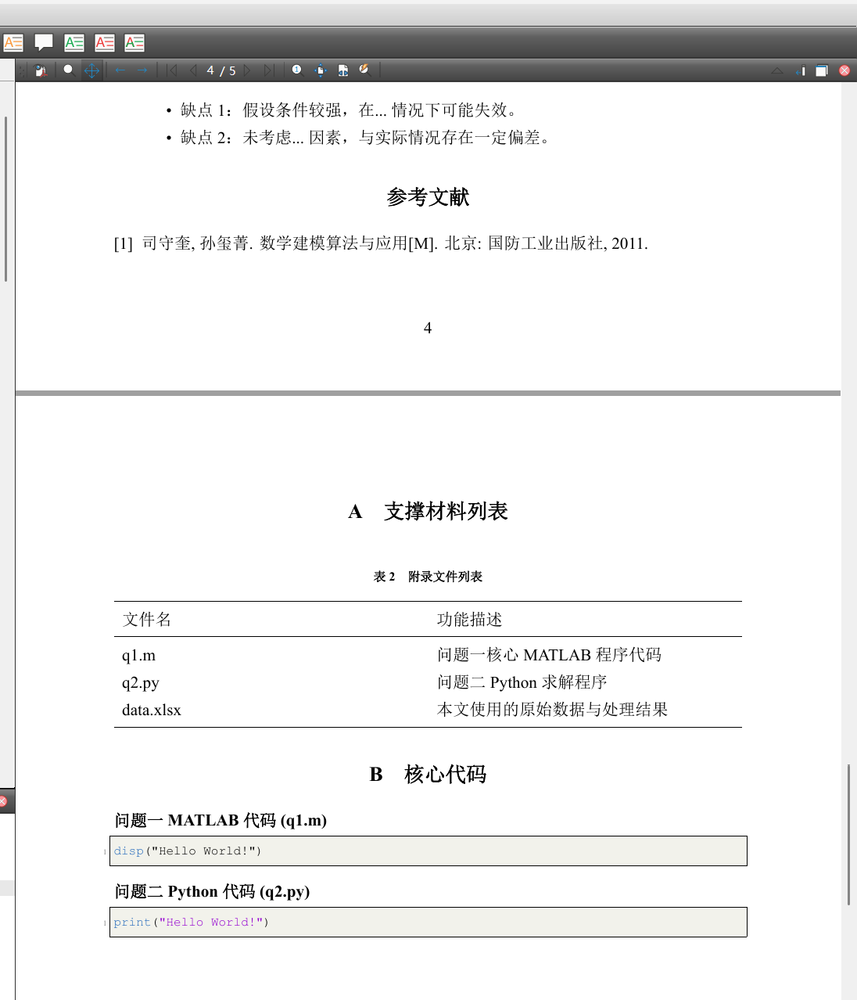

# CUMCM-LaTeX-Template
一份现代化、功能强大、高度自定义的全国大学生数学建模竞赛（CUMCM/MCM）的 LaTeX 论文模板。

A modern, powerful, and highly customizable LaTeX template for the China Undergraduate Mathematical Contest in Modeling (CUMCM/MCM).


---

## 简介 (Introduction)

本模板旨在为参加全国大学生数学建模竞赛的同学提供一个美观、规范、易于上手的 LaTeX 论文写作框架。

它基于 `article` 类，使用 `xelatex` 编译，原生支持中文，并集成了大量在数学建模中常用的宏包和自定义环境，是作者去年调试并最终在国赛中获得国一的论文模板。

## 主要特性 (Features)

- **现代化编译**：原生支持 `XeLaTeX`，完美处理中文字体和排版。
- **高度自定义**：通过简单的文档选项，即可控制是否需要“承诺书与编号页”、是否需要生成“目录”等。
- **常用宏包预配置**：
  - `amsmath`, `amsfonts`, `amssymb`, `bm`: 强大的数学公式支持。
  - `graphicx`, `subcaption`: 方便的插图与子图功能。
  - `booktabs`, `tabularx`, `multirow`: 轻松绘制专业的三线表、跨行跨列表格。
  - `listings`: 美观的代码高亮，支持 MATLAB, Python, C++ 等多种语言。
  - `natbib`: 强大的文献引用管理，支持上标引用。
  - `hyperref`, `cleveref`: 智能的超链接和交叉引用（如图、表、公式的自动识别）。
- **预设环境**：内置了“定义”、“定理”、“引理”、“假设”等数学环境。
- **规范格式**：自动处理竞赛要求的封面、摘要、关键词、正文、参考文献、附录等部分的格式。

## 文件结构 (File Structure)

```
.
├── cumcmthesis.cls         # 模板的核心文档类文件
├── template.tex            # 论文模板的主文件
├── ref.bib                 # 参考文献数据库文件
├──assets/
│   └── p1.png            # 预览图
├── figures/                # 存放图片的文件夹
│   └── example.eps       # 示例图片
└── code/                   # 存放代码的文件夹
    ├── q1.m                # 示例 MATLAB 代码
    └── q2.py               # 示例 Python 代码
```

## 如何使用 (Quick Start)

### 1. 环境要求 (Prerequisites)

- 一个现代的 TeX 发行版，如 **TeX Live** 或 **MiKTeX**。
- **`xelatex`** 编译器。
- 操作系统中安装了必要的**中文字体**，如：`SimSun (宋体)`, `SimHei (黑体)`, `simkai.ttf (楷体)`, `Microsoft YaHei (微软雅黑)`。

### 2. 编译流程 (Compilation)

由于模板使用了 `bibtex` 进行文献管理和复杂的交叉引用，你需要**多次编译**来生成最终的 PDF 文件。标准的编译流程如下：

> **`XeLaTeX` -> `BibTeX` -> `XeLaTeX` -> `XeLaTeX`**

在大多数 TeX 编辑器（如 TeXstudio, VS Code + LaTeX Workshop）中，通常只需要连续执行“编译”命令2到3次即可。

### 3. 自定义你的论文

#### a. 文档选项

你可以在 `template.tex` 文件的第一行修改文档选项：
`\documentclass[option1,option2]{cumcmthesis}`

可用的选项包括：
- `withoutpreface`: **草稿模式**。不生成竞赛要求的“承诺书”和“编号专用页”，直接从标题摘要页开始，方便快速编译和预览内容。（目前国赛的要求似乎就是这个？反正我2024年的国一论文就是这样的，感兴趣的话可以在我主页找到）
- `notoc`: **无目录模式**。完全禁用模板中的目录功能。
- `bwprint`: **黑白打印模式**。将一些彩色元素（如超链接）转为黑白，适合打印。

**示例：**
```latex
% 一个不需要承诺书和目录的草稿
\documentclass[withoutpreface,notoc]{cumcmthesis}
```

#### b. 填写你的信息

打开 `template.tex` 文件，在导言区（`\begin{document}` 之前）填写你的论文信息：

```latex
\title{这里是你的论文标题}
\author{名字}
```

然后在正文中相应的位置填写你的摘要、关键词、正文内容等。

## 效果预览



## 作者 (Author)

- [Sustainable-Enjoyment](https://github.com/Sustainable-Enjoyment) (Wells Qu)

## 许可协议 (License)

本模板采用 MIT 许可协议。详情请见 [LICENSE](LICENSE) 文件。

---
*预祝所有参赛者在比赛中取得优异成绩！*
